## Casos de Uso

Este documento expande cada requisito funcional listado em [REQUISITOS.md](REQUISITOS.md) em um diagrama de sequência. O objetivo é tornar explícitas as interações entre os componentes descritos em [SERVICO.md](SERVICO.md), pois cada interação e cada fronteira entre componentes é um ponto candidato a ameaça na [modelagem STRIDE](MODELAGEM_AMEACAS.md).

---

### 1. Convenções

**Participantes dos diagramas**

| Participante      | Componente em SERVICO.md | Papel                                                                                          |
|-------------------|--------------------------|------------------------------------------------------------------------------------------------|
| Promotor          | Usuário                  | Ator primário. Membro da promotoria autenticado no sistema                                     |
| Backend           | Backend                  | Recebe as requisições do promotor, valida sessão e permissões, orquestra os demais componentes |
| Integração        | Integração               | API que intermedeia o acesso ao Sistema Processos                                              |
| Sistema Processos | Sistema Processos        | Sistema do Estado que detém os dados dos processos e as mídias originais                       |
| Storage           | Storage                  | Armazena a cópia da mídia e a transcrição gerada                                               |
| Fila              | Enfileiramento           | Desacopla a solicitação do processamento assíncrono                                            |
| Módulo I.A        | Módulo I.A               | Consome a fila, envia a mídia para a I.A e persiste o resultado                                |
| I.A               | I.A                      | Serviço externo de I.A acessado via API, usado para transcrição e chat                         |

**Registro de transcrições.** O Backend mantém um registro com o identificador de cada transcrição, o promotor solicitante, o processo, a mídia, o caminho no Storage e o status. Nos diagramas, operações sobre esse registro aparecem como mensagens do Backend para ele mesmo. O high-level design em SERVICO.md ainda não possui um componente de persistência para esse registro.

**Status de uma transcrição.** Os valores possíveis são `na fila`, `em processamento`, `finalizada` e `falha`. As transições ocorrem em RQF3 e RQF4.

**Validação de sessão.** Toda requisição do promotor ao Backend passa por validação do token de sessão emitido em RQF1. Quando a validação falha, o Backend responde com erro de sessão inválida e o fluxo termina. Essa etapa aparece nos diagramas como uma mensagem do Backend para ele mesmo.

**Premissas adotadas**

1. O promotor não faz upload de arquivos. Ele escolhe uma mídia já existente no Sistema Processos e o Backend transfere uma cópia para o Storage. O limite de 80MB em RQNF3.1 se aplica a essa transferência.
2. O Módulo I.A informa o Backend sobre mudanças de status da transcrição.
3. No chat, o Backend chama a I.A diretamente, sem passar pelo Módulo I.A e sem passar pela fila.
4. O arquivo .docx é gerado pelo Backend sob demanda a partir da transcrição armazenada no Storage.
5. A origem das mídias é o Sistema Processos, sistema externo do Estado. Como as mídias entram lá é responsabilidade de terceiros e está fora do escopo deste serviço. O acesso ocorre somente via Integração, com três operações: consultar processo e listar mídias, consultar metadados de uma mídia e buscar o arquivo de uma mídia. O serviço nunca escreve no Sistema Processos. O serviço confia na decisão de autorização por processo retornada pelo Sistema Processos. O serviço não confia no conteúdo do arquivo recebido: formato, tamanho declarado e ausência de conteúdo malicioso são validados pelo Backend antes da cópia para o Storage.

---

### 2. Índice

| Requisito | Caso de uso                                                                                             |
|-----------|---------------------------------------------------------------------------------------------------------|
| RQF1      | [Acesso com credenciais](#rqf1-acesso-com-credenciais)                                                  |
| RQF2      | [Pesquisa de mídias de um processo](#rqf2-pesquisa-de-mídias-de-um-processo)                            |
| RQF3      | [Solicitação de transcrição de mídia](#rqf3-solicitação-de-transcrição-de-mídia)                        |
| RQF4      | [Acompanhamento do status da transcrição](#rqf4-acompanhamento-do-status-da-transcrição)                |
| RQF5      | [Listagem de transcrições por processo](#rqf5-listagem-de-transcrições-por-processo)                    |
| RQF6      | [Acesso a transcrição finalizada](#rqf6-acesso-a-transcrição-finalizada)                                |
| RQF7      | [Seleção de transcrição como contexto para a I.A](#rqf7-seleção-de-transcrição-como-contexto-para-a-ia) |
| RQF8      | [Download da transcrição em .docx](#rqf8-download-da-transcrição-em-docx)                               |
| RQF9      | [Exclusão de transcrição](#rqf9-exclusão-de-transcrição)                                                |
| RQF10     | [Interação com a I.A](#rqf10-interação-com-a-ia)                                                        |
| RQF11     | [Encerramento de sessão](#rqf11-encerramento-de-sessão)                                                 |

---

### RQF1: Acesso com credenciais

**Ator:** Promotor.

**Pré-condições:** o promotor possui credenciais cadastradas.

**Pós-condições:** em caso de sucesso, existe uma sessão ativa vinculada ao promotor e o token de sessão foi entregue a ele.

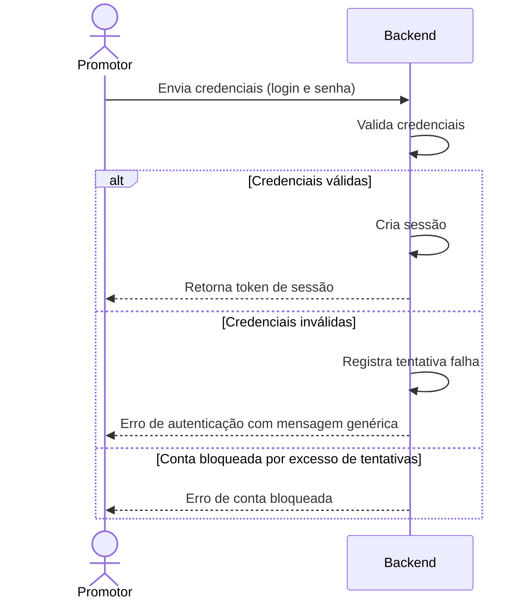

**Notas:** a mensagem genérica evita revelar se o login existe. O mecanismo de validação (base própria ou provedor de identidade do Estado) ainda não está definido em SERVICO.md.

---

### RQF2: Pesquisa de mídias de um processo

**Ator:** Promotor.

**Pré-condições:** sessão ativa. O promotor conhece o número do processo.

**Pós-condições:** o promotor visualiza a lista de mídias do processo, ou recebe a razão pela qual a lista não pôde ser exibida.

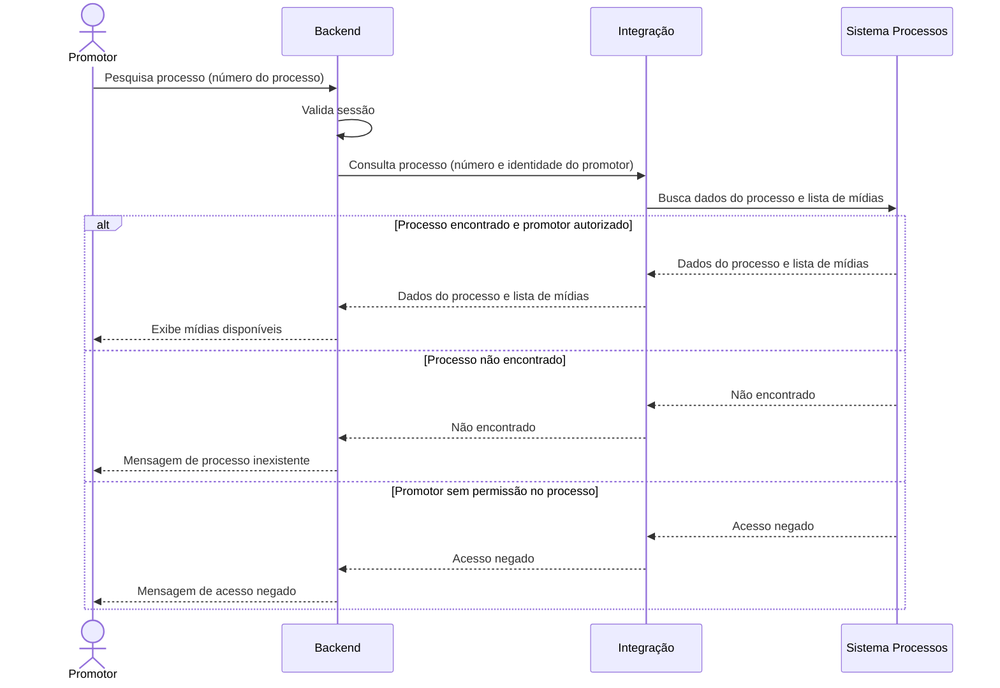

**Notas:** a autorização por processo é decidida pelo Sistema Processos com base na identidade do promotor repassada pelo Backend.

---

### RQF3: Solicitação de transcrição de mídia

**Ator:** Promotor.

**Pré-condições:** sessão ativa. O promotor visualizou a lista de mídias do processo (RQF2).

**Pós-condições:** em caso de sucesso, a mídia está copiada no Storage, existe um registro de transcrição com status `na fila` e uma mensagem foi publicada na fila.

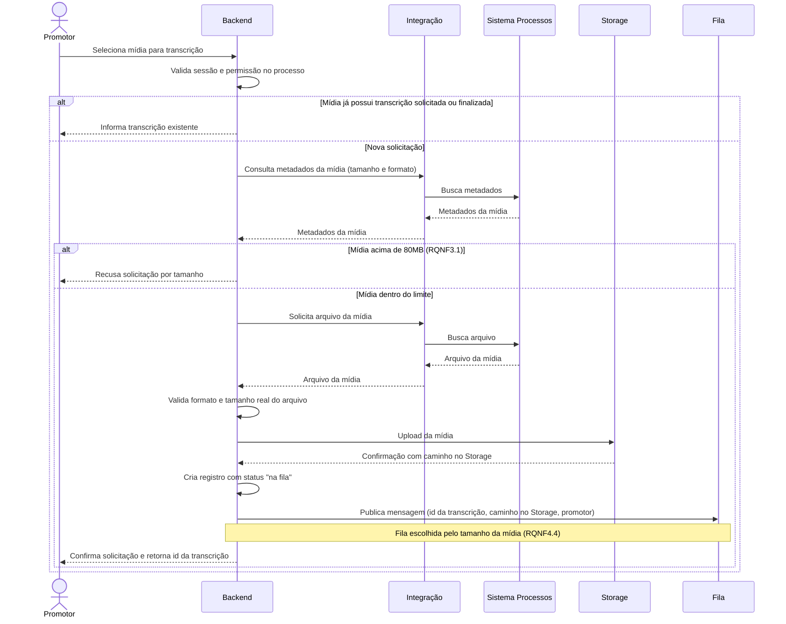

**Notas:** a verificação de tamanho pelos metadados ocorre antes da transferência do arquivo para evitar tráfego desnecessário. A validação após o recebimento cobre o caso em que o arquivo real diverge dos metadados declarados (premissa 5). Se essa validação falhar, o Backend recusa a solicitação e não copia o arquivo para o Storage. O promotor pode solicitar mais de uma transcrição (RQNF4.2), então o fluxo se repete por mídia.

---

### RQF4: Acompanhamento do status da transcrição

**Ator:** Promotor.

**Pré-condições:** existe um registro de transcrição com status `na fila` (RQF3).

**Pós-condições:** o registro termina com status `finalizada` ou `falha`. Em caso de sucesso, a transcrição está salva no Storage.

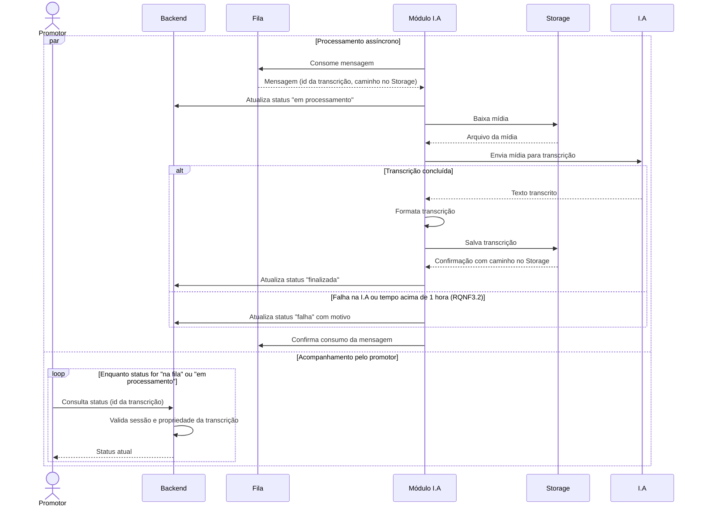

**Notas:** a mensagem só é confirmada na fila após o registro do status final, para que uma queda do Módulo I.A no meio do processamento permita reprocessamento. Uma consulta a transcrição de outro promotor retorna acesso negado.

---

### RQF5: Listagem de transcrições por processo

**Ator:** Promotor.

**Pré-condições:** sessão ativa.

**Pós-condições:** o promotor visualiza suas transcrições agrupadas por processo, com o status de cada uma.

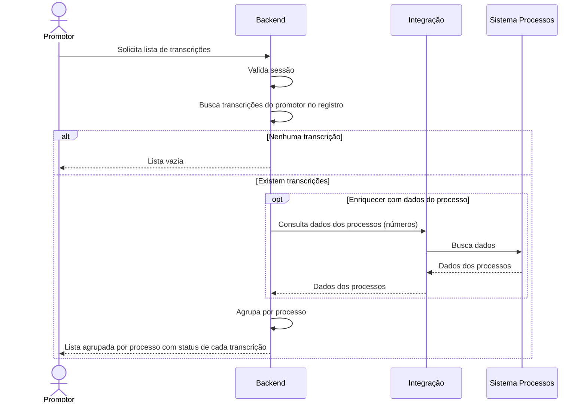

**Notas:** a lista contém apenas transcrições do próprio promotor. Se a consulta ao Sistema Processos falhar, a lista é exibida somente com os números dos processos.

---

### RQF6: Acesso a transcrição finalizada

**Ator:** Promotor.

**Pré-condições:** sessão ativa. Existe uma transcrição do promotor com status `finalizada`.

**Pós-condições:** o promotor visualiza o conteúdo da transcrição.

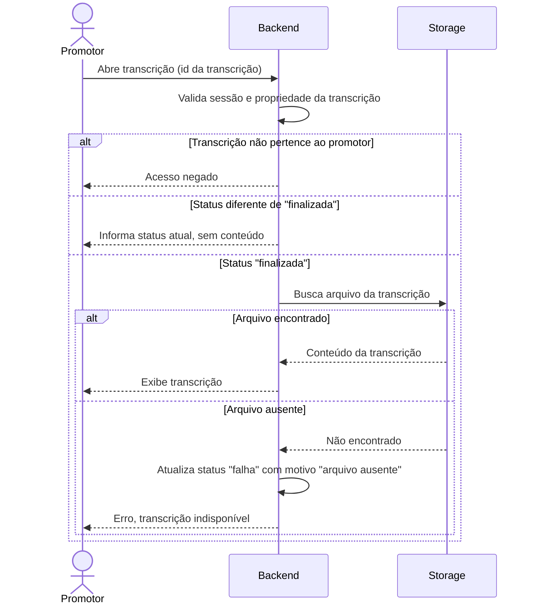

**Notas:** um arquivo ausente para uma transcrição com status `finalizada` indica perda ou remoção indevida no Storage e deve gerar evento de auditoria.

---

### RQF7: Seleção de transcrição como contexto para a I.A

**Ator:** Promotor.

**Pré-condições:** sessão ativa. Existe uma transcrição do promotor com status `finalizada`.

**Pós-condições:** existe uma sessão de chat em memória no Backend, vinculada ao promotor, com a transcrição carregada como contexto. A interação em si ocorre em RQF10.

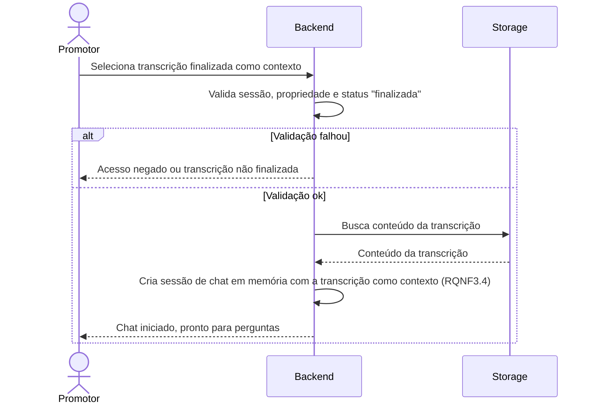

**Notas:** a transcrição é passada como contexto automaticamente, sem ação adicional do promotor (RQNF3.4). O contexto vive apenas em memória e é descartado ao encerrar o chat (RQNF3.3).

---

### RQF8: Download da transcrição em .docx

**Ator:** Promotor.

**Pré-condições:** sessão ativa. Existe uma transcrição do promotor com status `finalizada`.

**Pós-condições:** o promotor recebe um arquivo .docx com o conteúdo da transcrição.

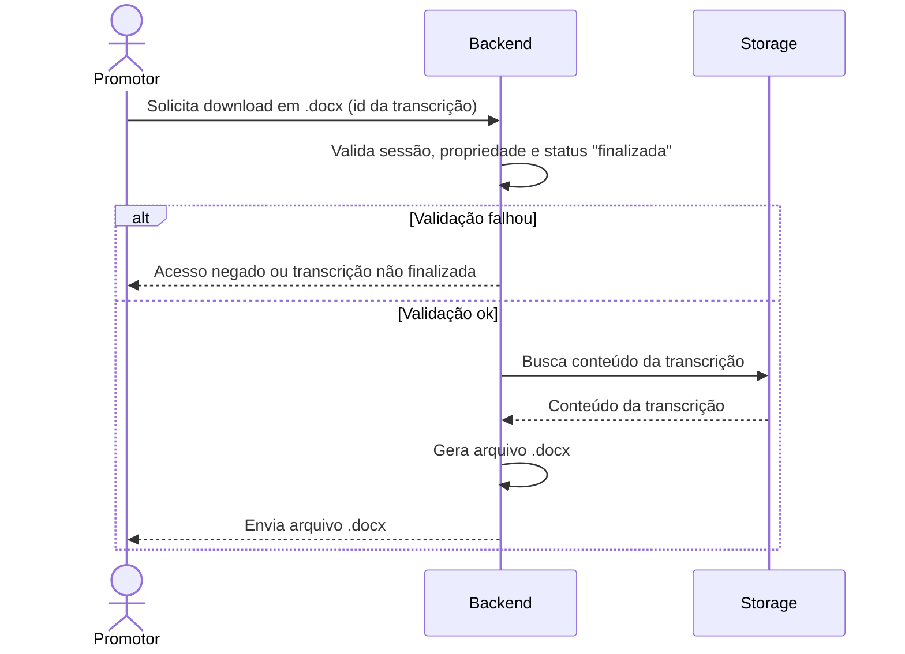

**Notas:** o arquivo sai do controle do sistema após o download. Esse é o ponto em que dados dos ativos A2, A3 e A5 deixam o perímetro da aplicação.

---

### RQF9: Exclusão de transcrição

**Ator:** Promotor.

**Pré-condições:** sessão ativa. Existe uma transcrição do promotor com status `finalizada` ou `falha`.

**Pós-condições:** em caso de sucesso, a mídia e a transcrição foram removidas do Storage e o registro foi removido. A mídia original permanece no Sistema Processos.

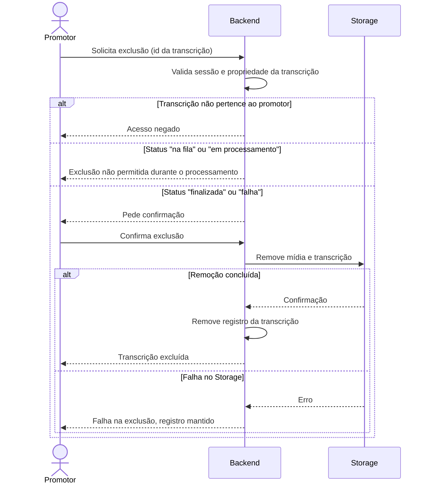

**Notas:** o registro só é removido após a confirmação do Storage, para não deixar arquivos órfãos com dados sensíveis.

---

### RQF10: Interação com a I.A

**Ator:** Promotor.

**Pré-condições:** existe uma sessão de chat criada em RQF7.

**Pós-condições:** ao encerrar, o contexto e o histórico do chat foram descartados (RQNF3.3).

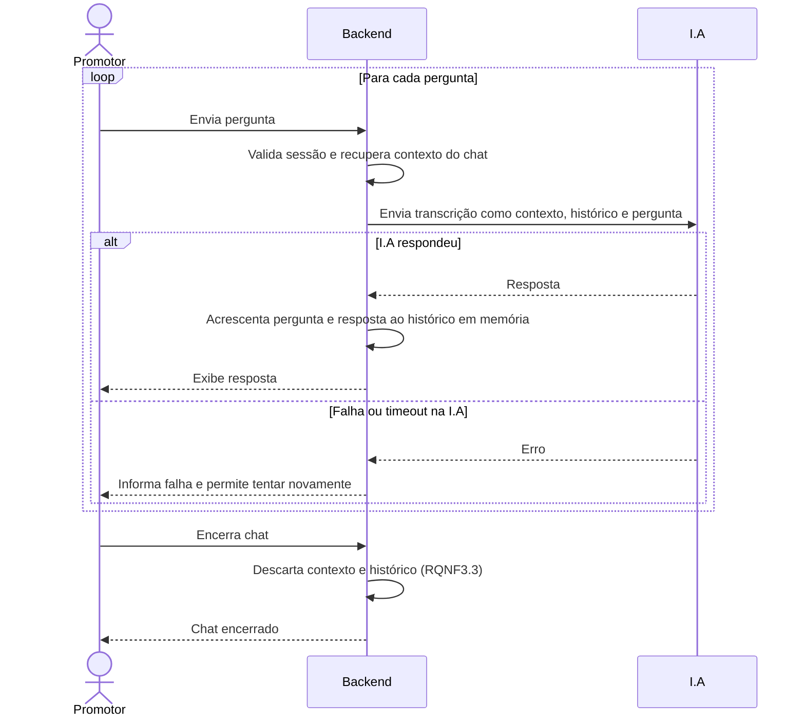

**Notas:** a transcrição inteira e as perguntas do promotor trafegam para a I.A externa a cada mensagem. Esse é o principal ponto de exposição do ativo A6.

---

### RQF11: Encerramento de sessão

**Ator:** Promotor.

**Pré-condições:** sessão ativa.

**Pós-condições:** o token de sessão está inválido e qualquer chat ativo foi descartado.

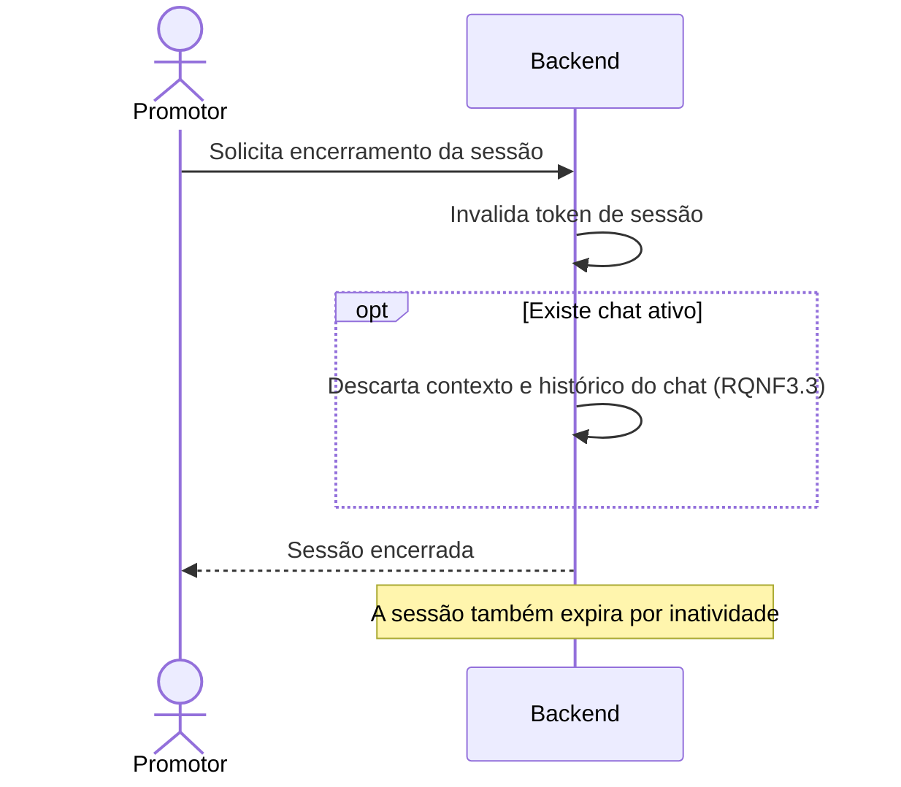

**Notas:** o tempo de expiração por inatividade ainda não está definido nos requisitos não funcionais.

---

### 3. Manutenção deste documento

- Ao incluir, alterar ou remover um requisito funcional em REQUISITOS.md, atualizar a seção correspondente aqui e a tabela do índice.
- Ao alterar a tabela de componentes em SERVICO.md, atualizar a tabela de participantes na seção 1 e os nomes usados nos diagramas.
- Ao resolver uma premissa da seção 1, remover a premissa e ajustar os diagramas afetados.
- Cada ameaça em MODELAGEM_AMEACAS.md deve apontar para um RQF deste documento. Se uma ameaça não encontrar interação correspondente em nenhum diagrama, o diagrama está incompleto.
