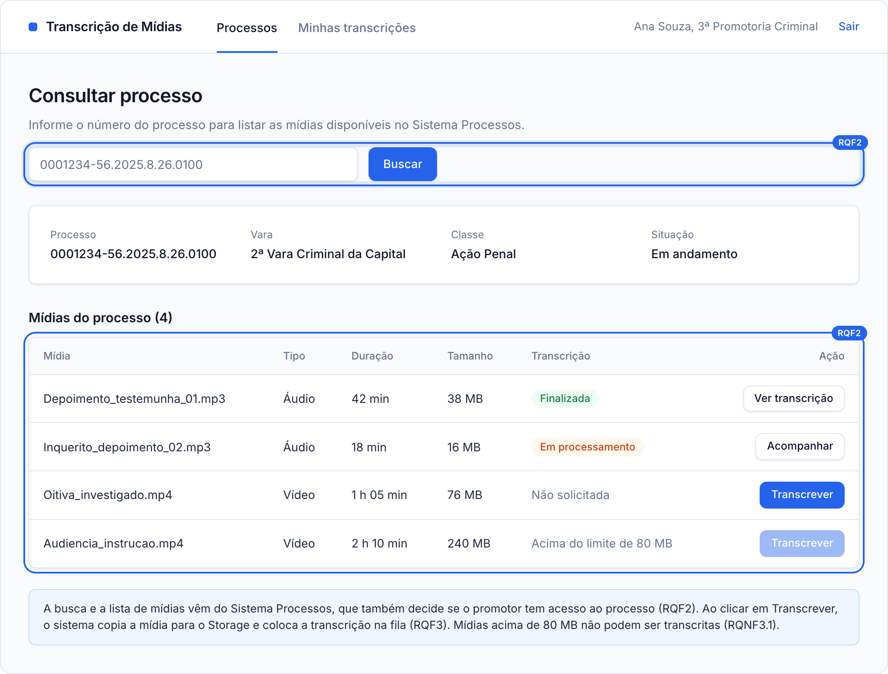
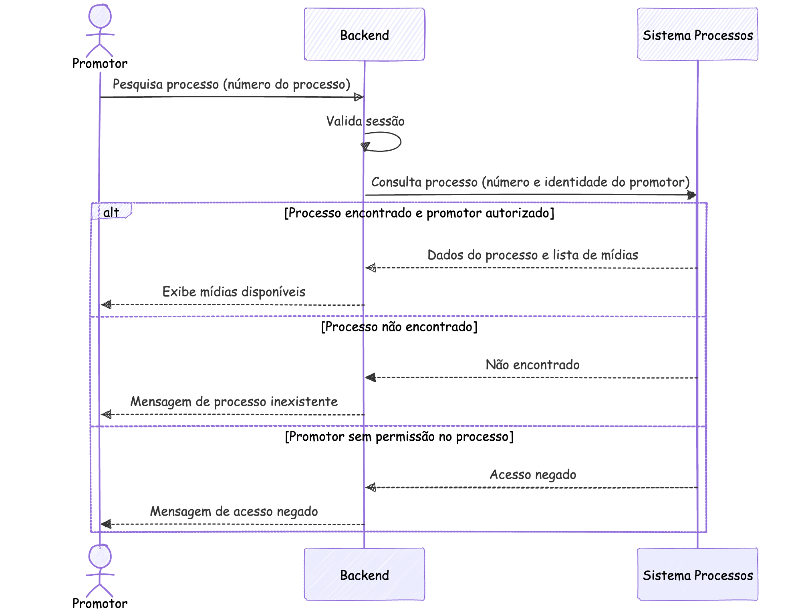
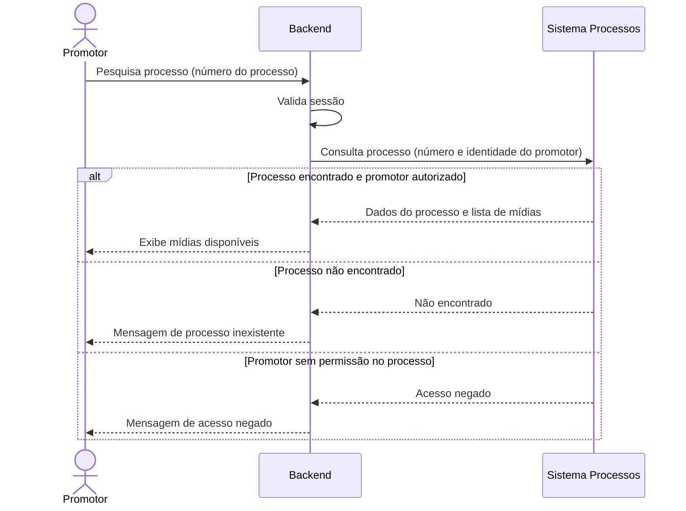

### RQF2: Pesquisa de mídias de um processo

Convenções, participantes e premissas estão no [README](README.md) desta pasta.

**Pré-condições:** sessão ativa. O promotor conhece o número do processo.

**Pós-condições:** em caso de sucesso, o promotor tem a lista de mídias do processo.

**Tela de referência:** T2 Processo.

Código mermaid

**Notas:** o Sistema Processos decide a autorização por processo com base na identidade do promotor repassada pelo Backend.
