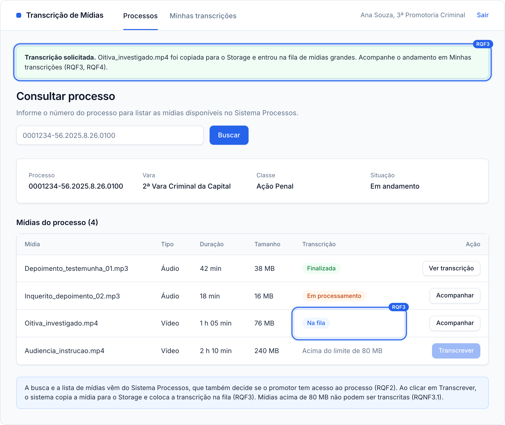
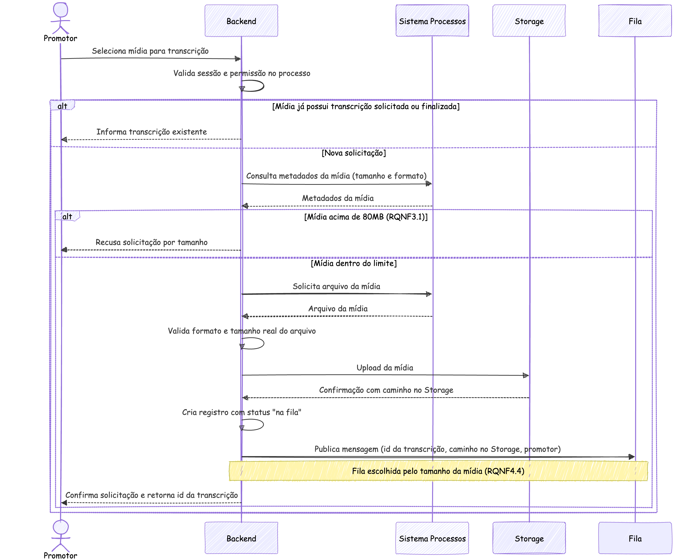
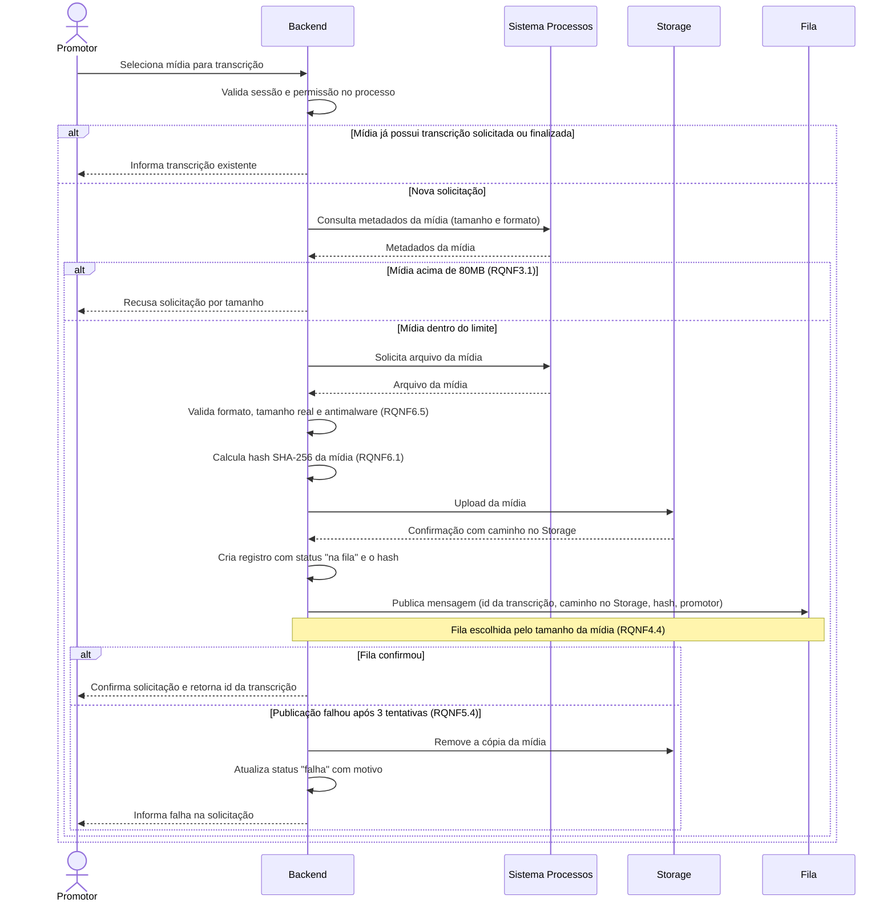

### RQF3: Solicitação de transcrição de mídia

Convenções, participantes e premissas estão no [README](README.md) desta pasta.

**Pré-condições:** sessão ativa. O promotor visualizou a lista de mídias do processo (RQF2).

**Pós-condições:** em caso de sucesso, a mídia está copiada no Storage, existe um registro de transcrição com status `na fila` e uma mensagem foi publicada na fila.

**Tela de referência:** T2b Transcrição solicitada.

Código mermaid

**Notas:** verificar o tamanho pelos metadados antes de transferir evita tráfego desnecessário. A validação após o recebimento cobre o caso em que o arquivo real diverge dos metadados declarados (premissa 5). Se ela falhar, o Backend recusa a solicitação e não copia o arquivo para o Storage. O promotor pode solicitar mais de uma transcrição (RQNF4.2), então o fluxo se repete por mídia.
