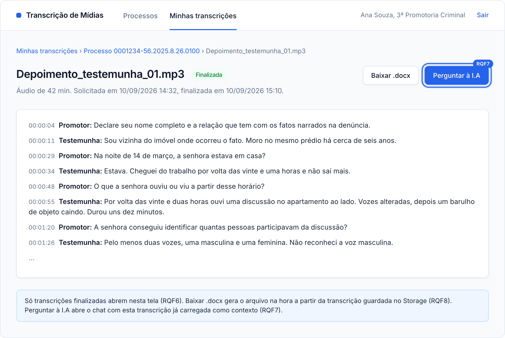
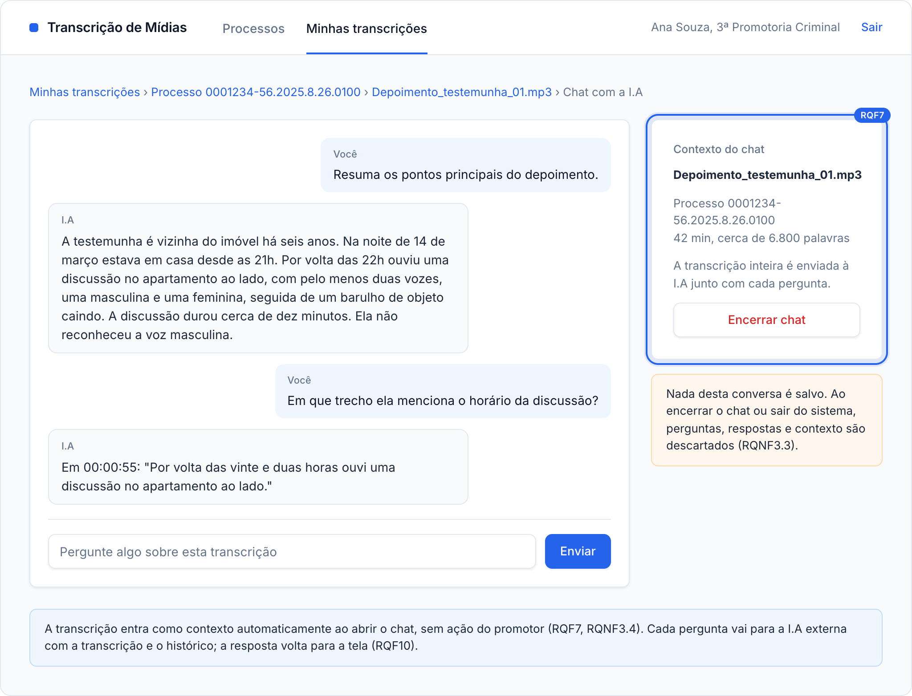
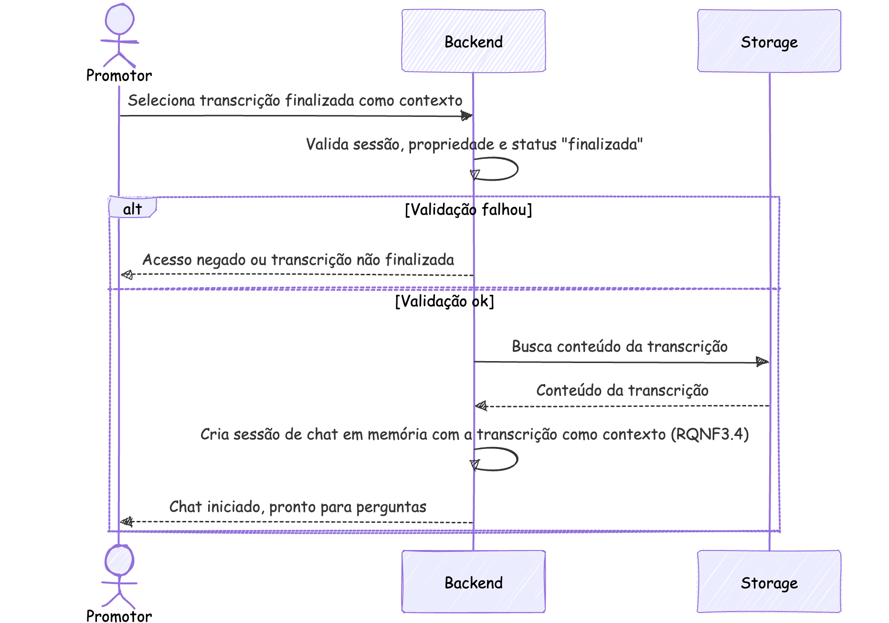
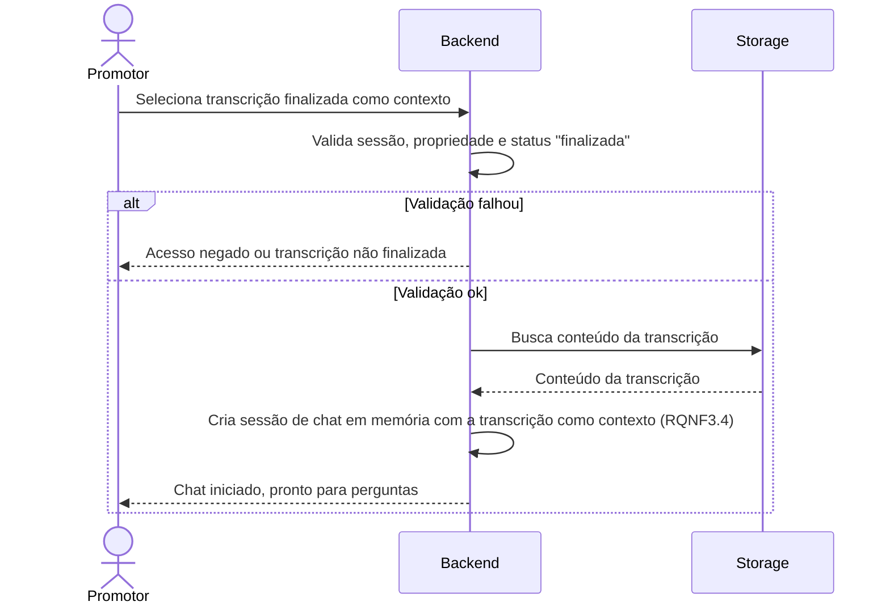

### RQF7: Seleção de transcrição como contexto para a I.A

Convenções, participantes e premissas estão no [README](README.md) desta pasta.

**Pré-condições:** sessão ativa. Existe uma transcrição do promotor com status `finalizada`.

**Pós-condições:** existe uma sessão de chat em memória no Backend, vinculada ao promotor, com a transcrição carregada como contexto. A interação em si ocorre em RQF10.

**Telas de referência:** T4 Transcrição e T5 Chat com a I.A.

Código mermaid

