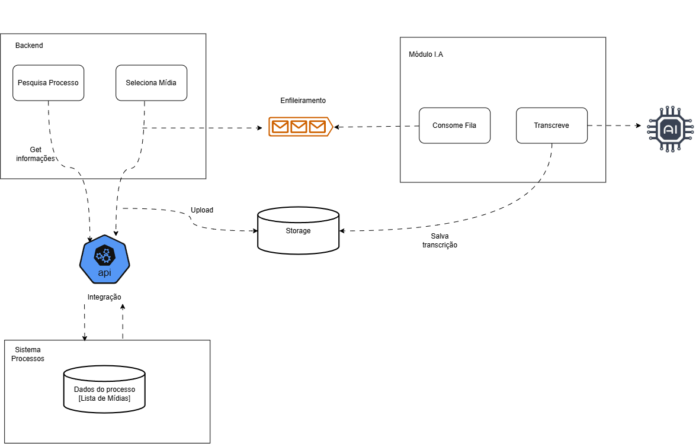

## Descrição do Serviço Usado como Case

### Serviço de transcrição de mídias para um Ministério Público do Estado

---

### 1. O que é

Um serviço que recebe mídias relacionadas a processos e realiza a transcrição das mesmas. Essas mídias podem ser gravações de depoimentos, oitivas e inquéritos policiais.

---

### 2. Como faz

O usuário consulta um determinado processo dentro de uma plataforma e procura pelas mídias disponíveis. Seleciona a mídia que deseja transcrever. Um upload da mídia é feito para outro serviço de storage do cliente, e uma mensagem é enviada para uma fila para iniciar a transcrição. A transcrição é feita por uma I.A e disponibilizada para o cliente dentro desse mesmo serviço.

---

### 3. Para que serve

O serviço é usado para obter uma versão transcrita (textual) de mídias de longas duração, e permitir a interação dessa versão transcrita com I.As.

---

### 4. Para quem

Usado por toda promotoria do estado. Todos interessados que possuem acesso a mídias (áudios e vídeos) relacionados a depoimentos e inquéritos.

**Fora de escopo.** Atores externos a este serviço (polícia, cartórios, servidores do Ministério Público) incluem as mídias nos processos, dentro do Sistema Processos. Este serviço lê processos e mídias pela API do Sistema Processos (Integração) e nunca escreve nele. O cadastro e a desativação de promotores acontecem no provedor de identidade institucional, e este serviço não gerencia usuários nem senhas.

---

### 5. Ativos

Na tabela abaixo serão listados os ativos importantes do sistema. O objetivo com isso é viabilizar a identificação de vulnerabilidades para a modelagem de ameaças.

| ID | Ativo | Descrição |
| --- | --- | --- |
| A1 | Credenciais | Credenciais de acesso da promotoria |
| A2 | Dados de processos | Dados relacionados a processos de natureza jurídica de todo estado |
| A3 | Mídias | Áudios e vídeos relacionados aos processos do ativo **A2** |
| A4 | Informações de cunho profissional | Informações relacionadas a quais processos cada membro da promotoria está atuando |
| A5 | Informações pessoais | Informações pessoais que podem estar contidas no ativo **A2** |
| A6 | Interações com I.A | Interações entre o usuário e a I.A disponibilizada dentro do serviço |

---

### 6 - High-level design da aplicação

A tabela abaixo descreve cada componente ilustrado no digrama high-level da aplicação.

| Componente | Descrição |
| --- | --- |
| Backend | Serviço web que recebe requisições do usuário. Interage com API que busca informações dos processos e envia para a fila a solicitação de transcrição |
| Provedor de Identidade | Serviço de autenticação institucional do Ministério Público (SSO). Valida as credenciais do promotor e emite o token de identidade que o Backend usa para criar a sessão |
| Integração | API do Sistema Processos, consumida diretamente pelo Backend. Não é um serviço próprio deste sistema |
| Sistema Processos | Sistema do Estado com as informações dos processos e mídias |
| Storage | Serviço de armazenamento na nuvem que vai persistir as mídias e suas transcrições |
| Enfileiramento | Sistema de filas para permitir o processamento assíncrono |
| Módulo I.A | Serviço python que "escuta" a fila e gerencia as requisições de transcrição. Envia a mídia para a I.A degravar e formata a saída para persistir a transcrição no formato ideal.
| I.A | Serviço de I.A utilizado via API |

