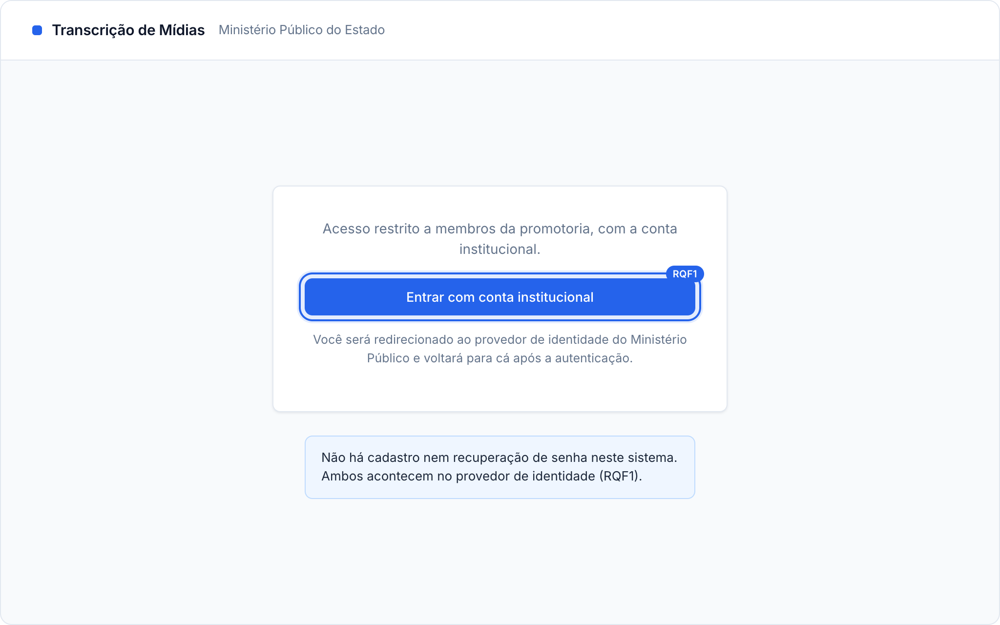
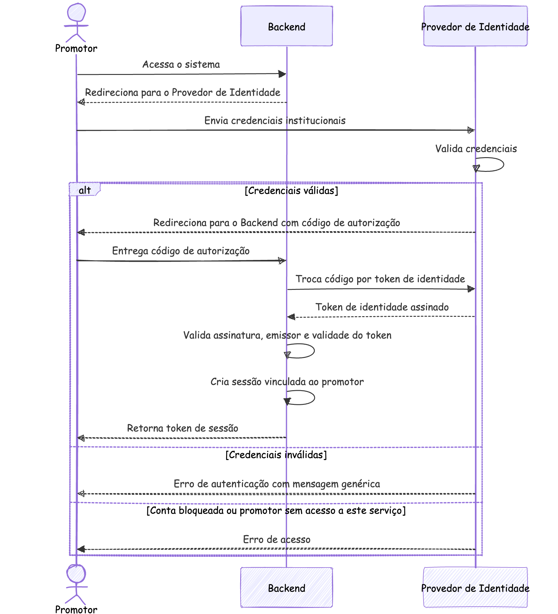
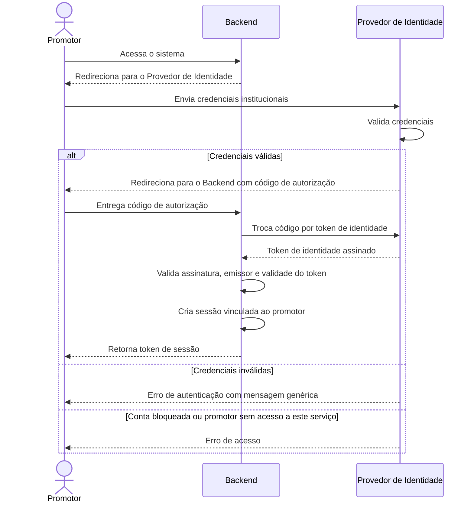

### RQF1: Acesso com credenciais

Convenções, participantes e premissas estão no [README](README.md) desta pasta.

**Ator:** Promotor.

**Pré-condições:** o promotor está cadastrado no provedor de identidade institucional (premissa 6).

**Pós-condições:** em caso de sucesso, existe uma sessão ativa no Backend vinculada ao promotor, que recebeu o token de sessão.

**Tela de referência:** T1 Entrada.

Código mermaid

**Notas:** as credenciais nunca passam pelo Backend. Bloqueio por tentativas, política de senha e segundo fator são responsabilidade do provedor de identidade. O Backend confia apenas em tokens assinados pelo provedor e valida a assinatura a cada login. A mensagem genérica evita revelar se o login existe.
