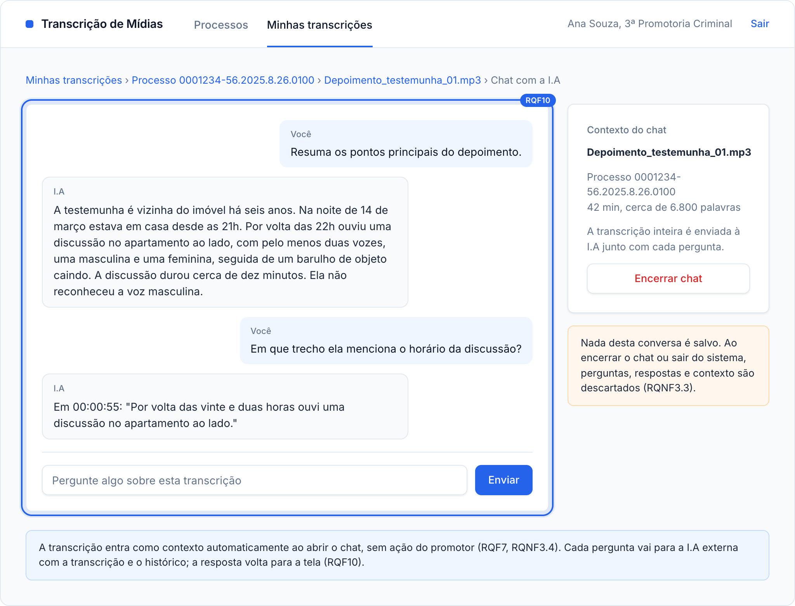
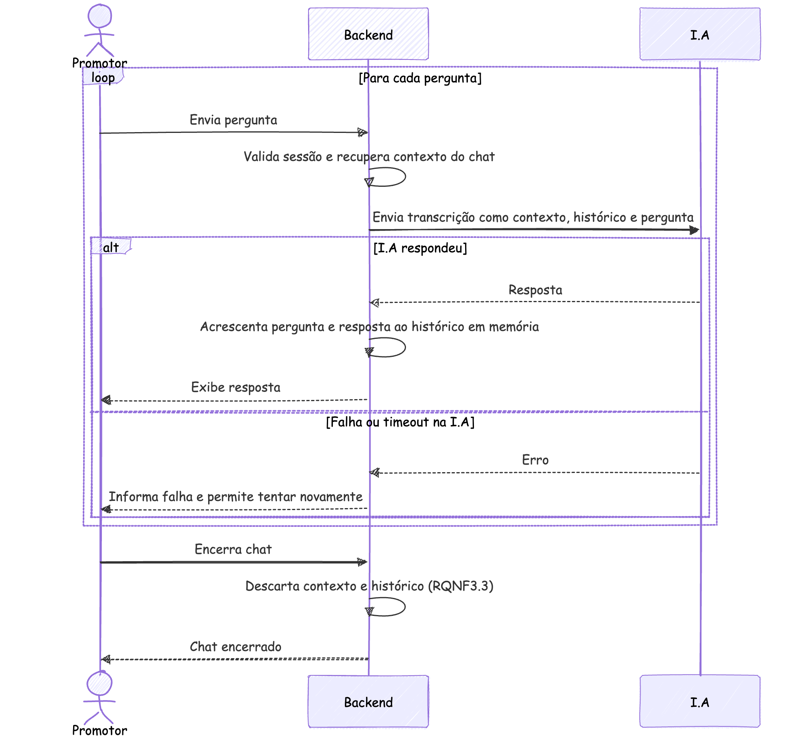
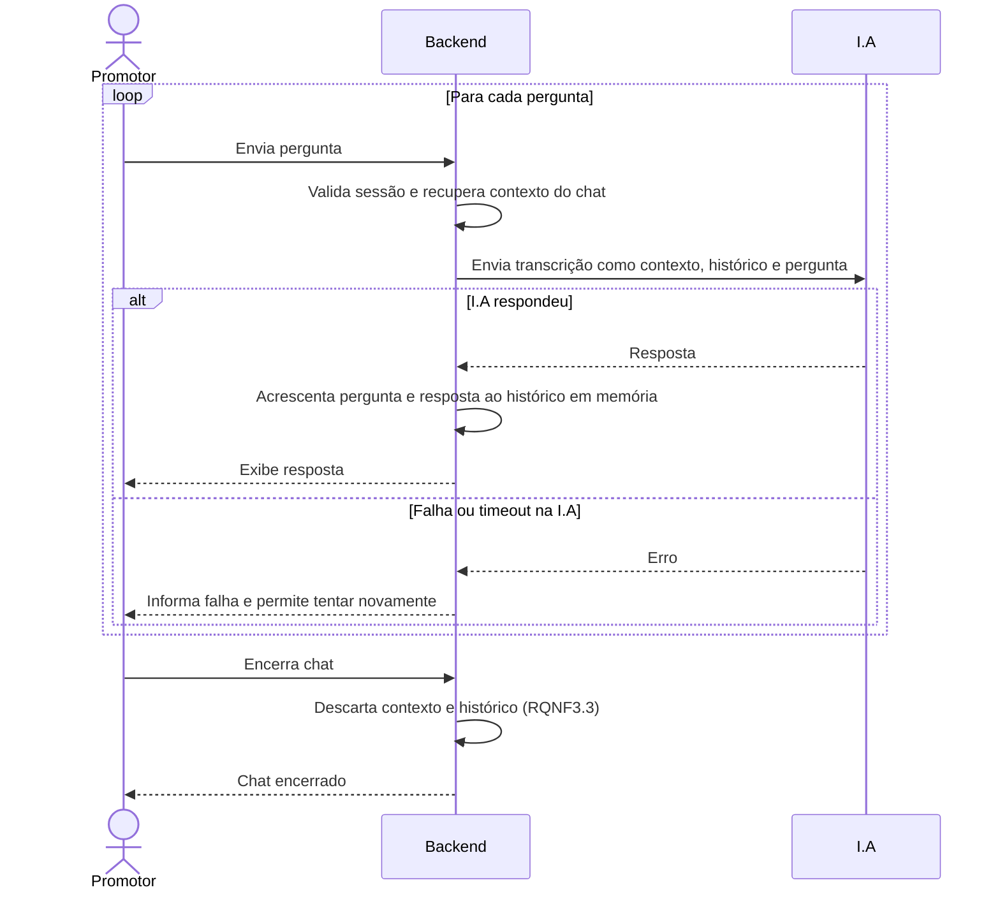

### RQF10: Interação com a I.A

Convenções, participantes e premissas estão no [README](README.md) desta pasta.

**Pré-condições:** existe uma sessão de chat criada em RQF7.

**Pós-condições:** após o encerramento do chat, não resta contexto nem histórico no Backend (RQNF3.3).

**Tela de referência:** T5 Chat com a I.A.

Código mermaid

**Notas:** a transcrição inteira e as perguntas do promotor trafegam para a I.A externa a cada mensagem. É o principal ponto de exposição do ativo A6.
