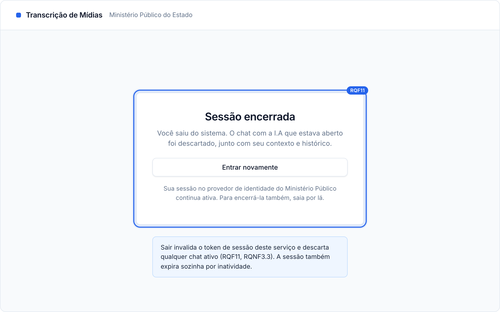
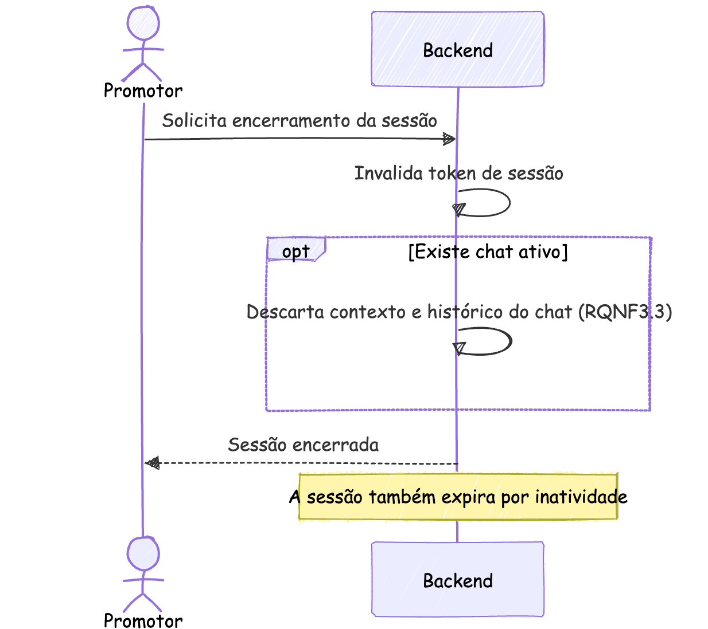
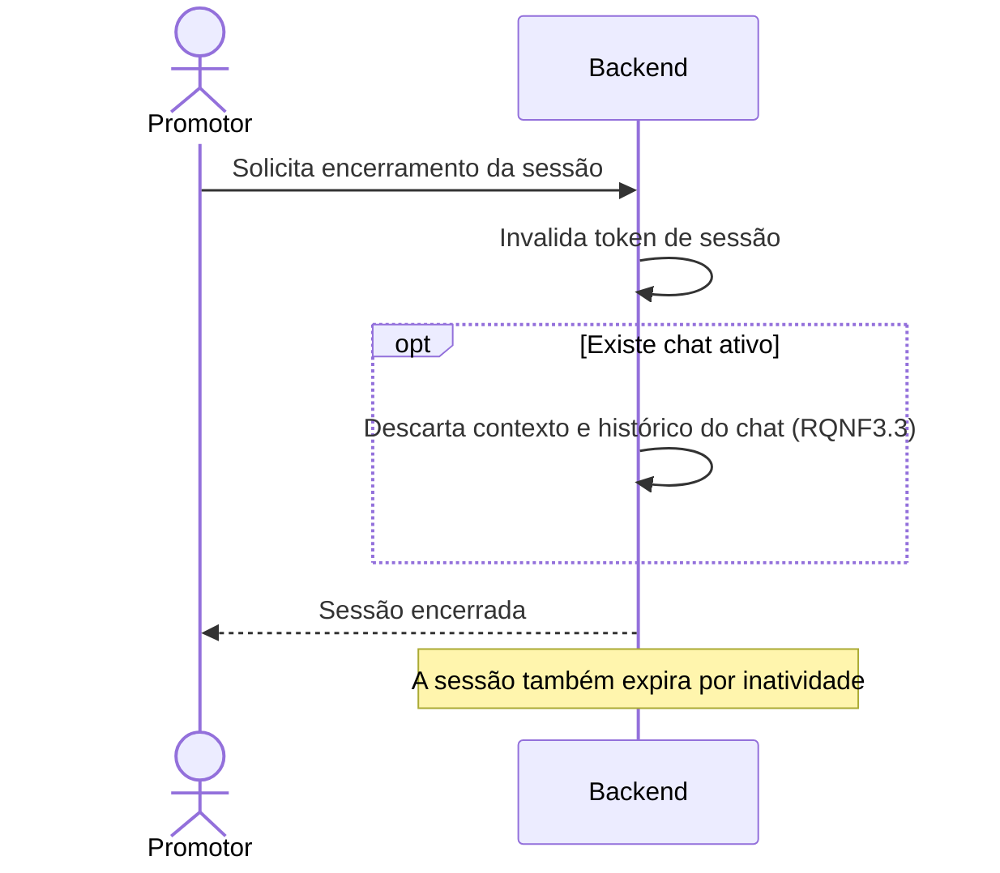

### RQF11: Encerramento de sessão

Convenções, participantes e premissas estão no [README](README.md) desta pasta.

**Ator:** Promotor.

**Pré-condições:** sessão ativa.

**Pós-condições:** o token de sessão está inválido e o Backend descartou qualquer chat ativo.

**Tela de referência:** T6 Sessão encerrada.

Código mermaid

**Notas:** o tempo de expiração por inatividade ainda não está definido nos requisitos não funcionais. O encerramento invalida apenas a sessão deste serviço. A sessão no provedor de identidade permanece, pois single logout não está previsto.
