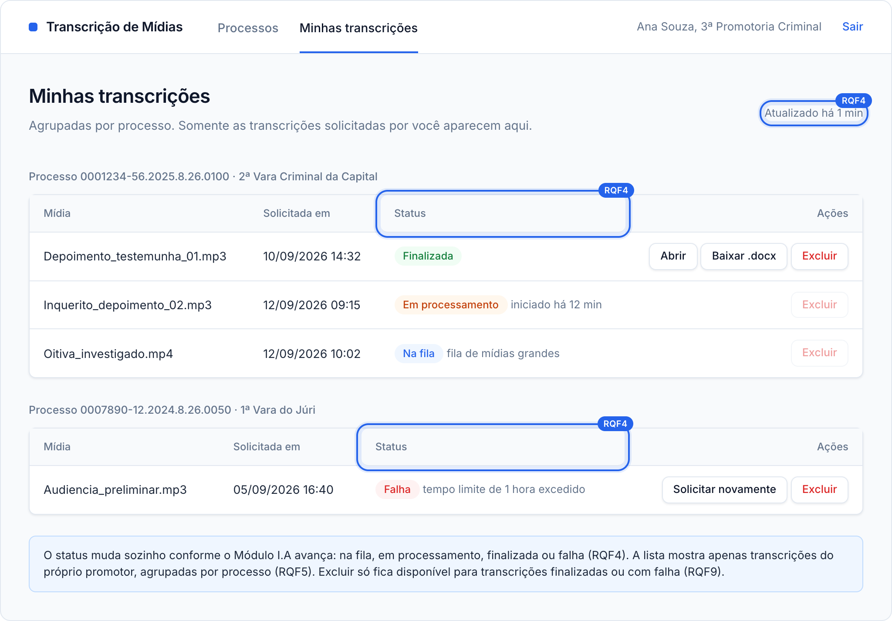
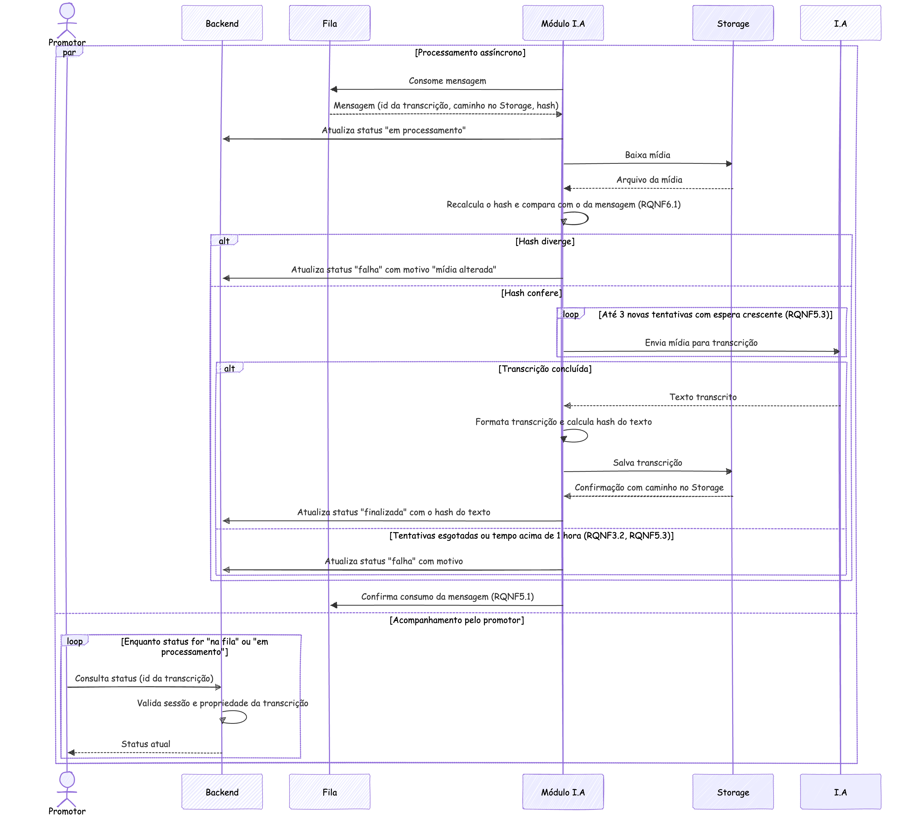
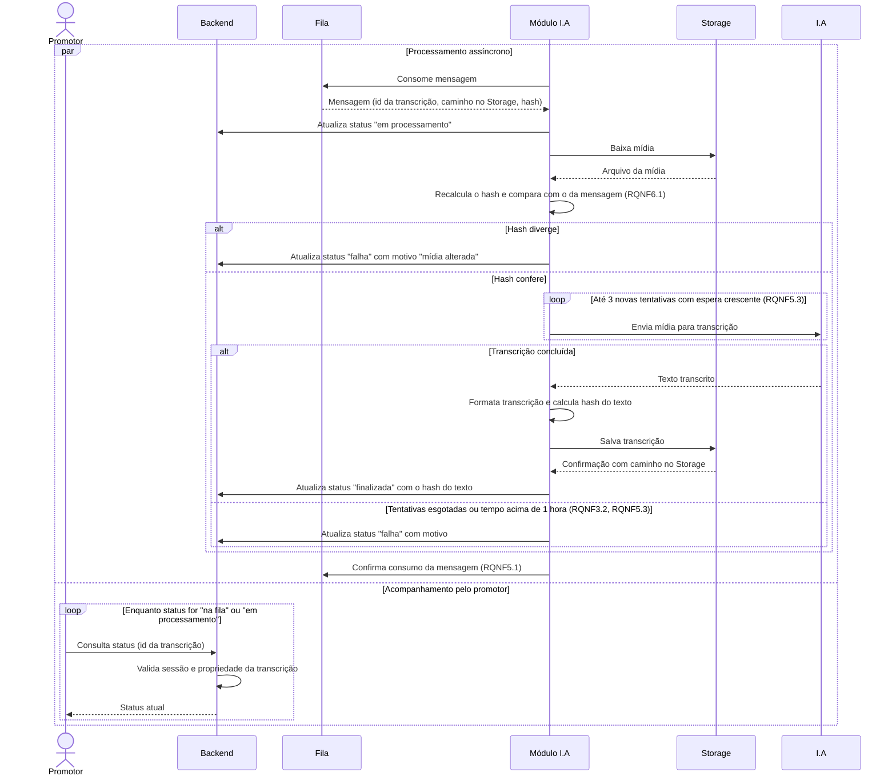

### RQF4: Acompanhamento do status da transcrição

Convenções, participantes e premissas estão no [README](README.md) desta pasta.

**Pré-condições:** existe um registro de transcrição com status `na fila` (RQF3).

**Pós-condições:** o registro termina com status `finalizada` ou `falha`. Em caso de sucesso, a transcrição está salva no Storage.

**Tela de referência:** T3 Minhas transcrições.

Código mermaid

**Notas:** o Módulo I.A só confirma a mensagem na fila após registrar o status final, para que a mensagem possa ser reprocessada se o módulo cair no meio do processamento. Uma consulta a transcrição de outro promotor retorna acesso negado.
