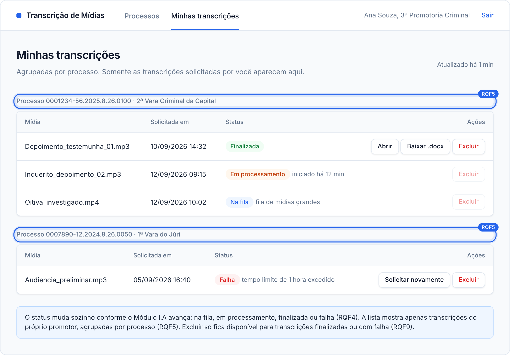
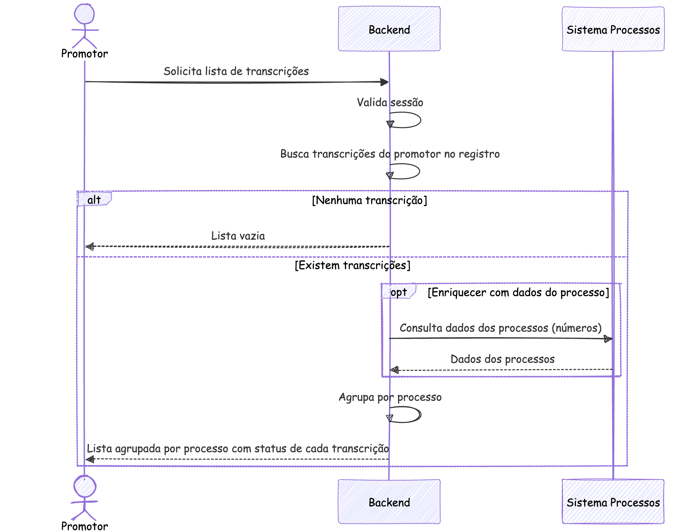
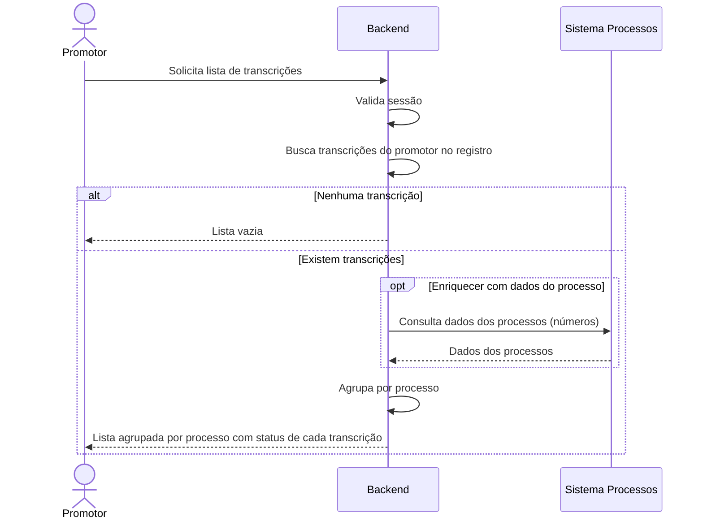

### RQF5: Listagem de transcrições por processo

Convenções, participantes e premissas estão no [README](README.md) desta pasta.

**Ator:** Promotor.

**Pré-condições:** sessão ativa.

**Pós-condições:** o promotor visualiza suas transcrições agrupadas por processo, com o status de cada uma.

**Tela de referência:** T3 Minhas transcrições.

Código mermaid

**Notas:** a lista contém apenas transcrições do próprio promotor. Se a consulta ao Sistema Processos falhar, a lista mostra somente os números dos processos.
