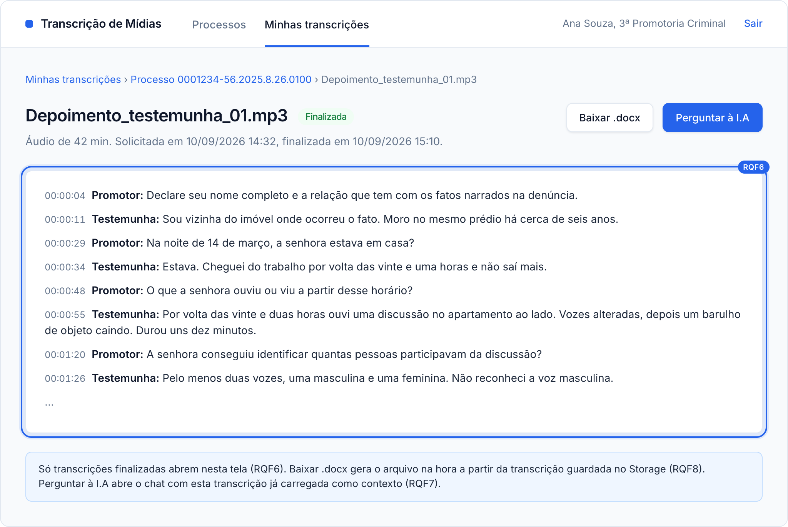
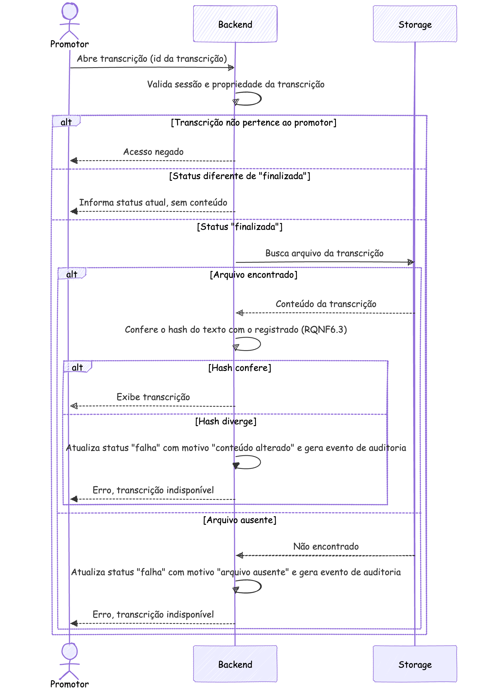
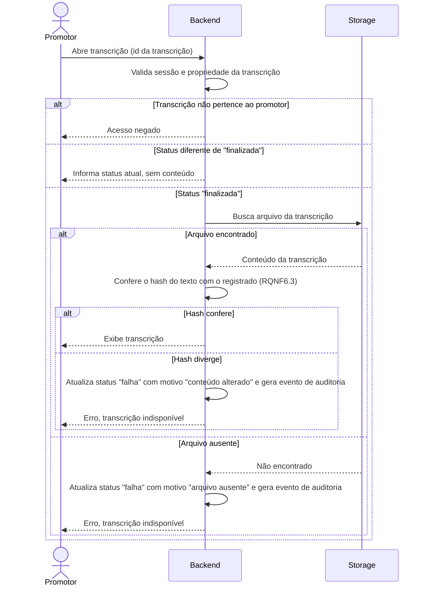

### RQF6: Acesso a transcrição finalizada

Convenções, participantes e premissas estão no [README](README.md) desta pasta.

**Pré-condições:** sessão ativa. Existe uma transcrição do promotor com status `finalizada`.

**Pós-condições:** o promotor visualiza o conteúdo da transcrição.

**Tela de referência:** T4 Transcrição.

Código mermaid

**Notas:** um arquivo ausente para uma transcrição com status `finalizada` indica perda ou remoção indevida no Storage e deve gerar evento de auditoria.
