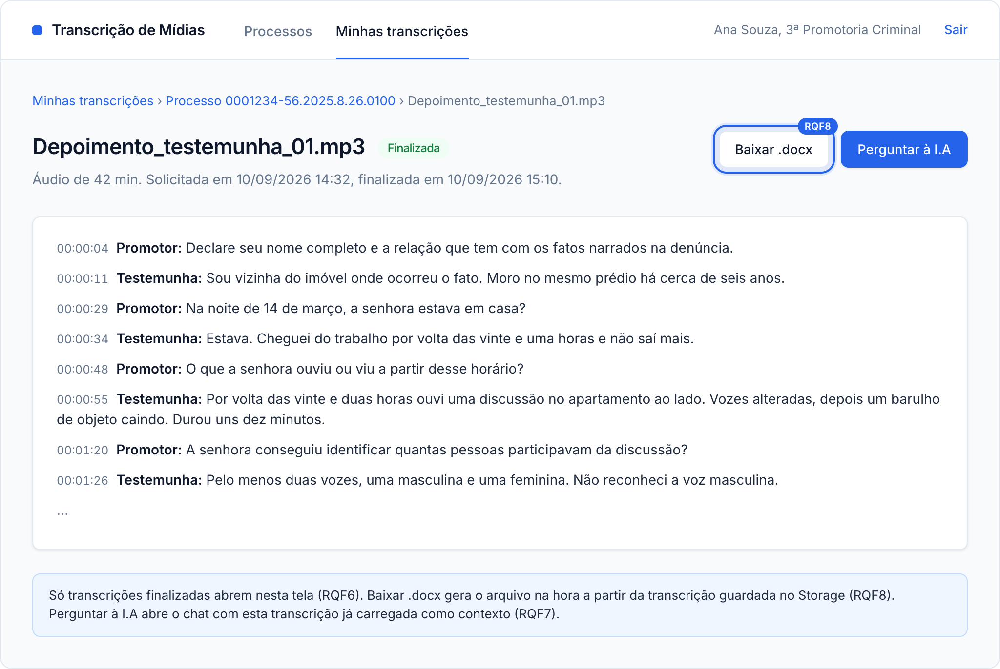
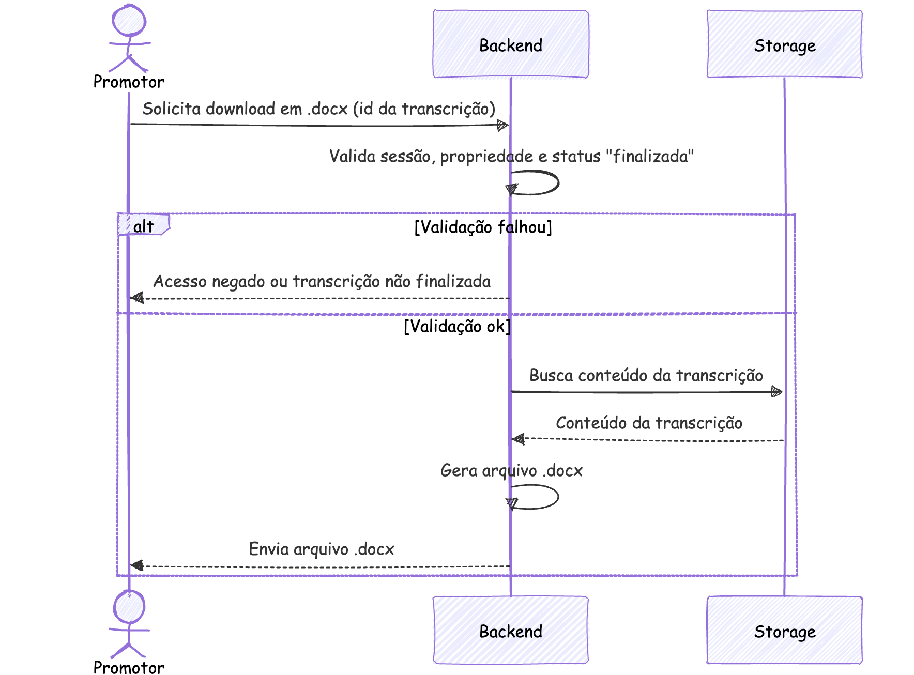
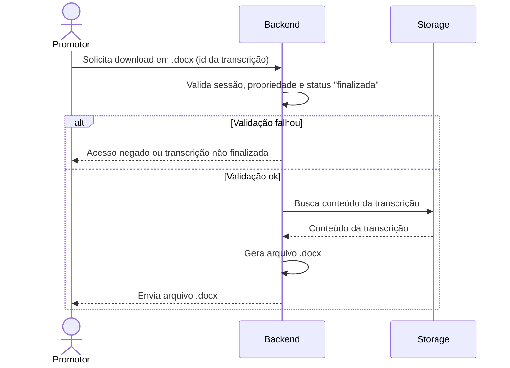

### RQF8: Download da transcrição em .docx

Convenções, participantes e premissas estão no [README](README.md) desta pasta.

**Pré-condições:** sessão ativa. Existe uma transcrição do promotor com status `finalizada`.

**Pós-condições:** o promotor recebe um arquivo .docx com o conteúdo da transcrição.

**Tela de referência:** T4 Transcrição.

Código mermaid

**Notas:** o download é o ponto em que dados dos ativos A2, A3 e A5 saem do controle do sistema.
