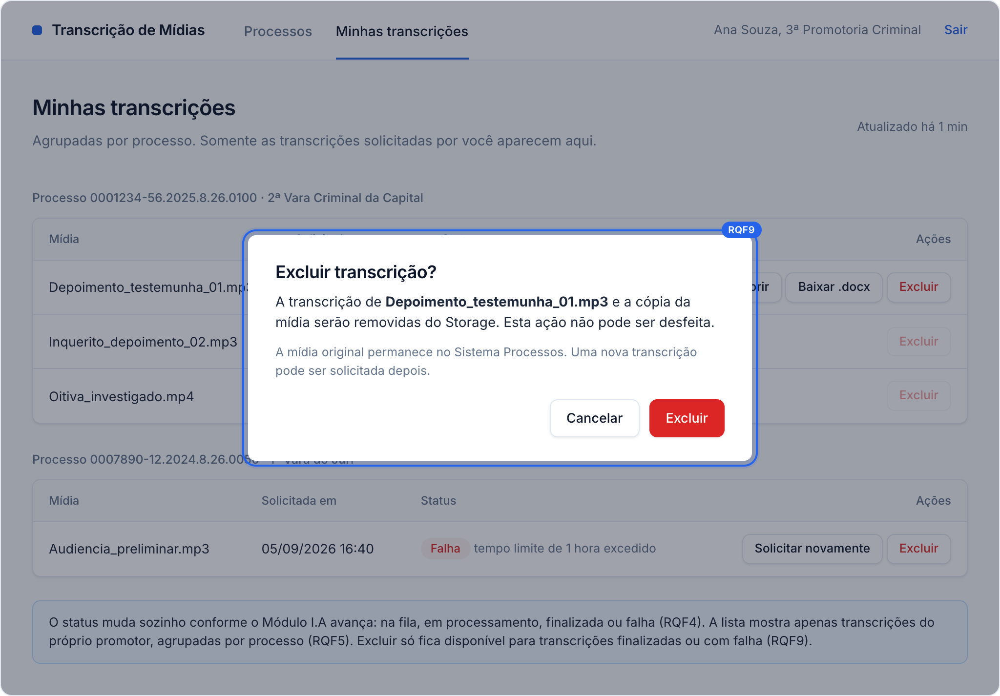
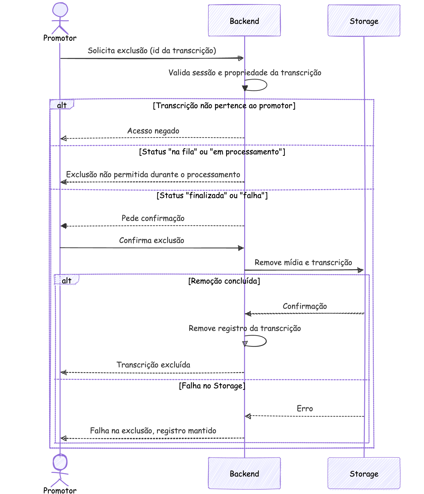
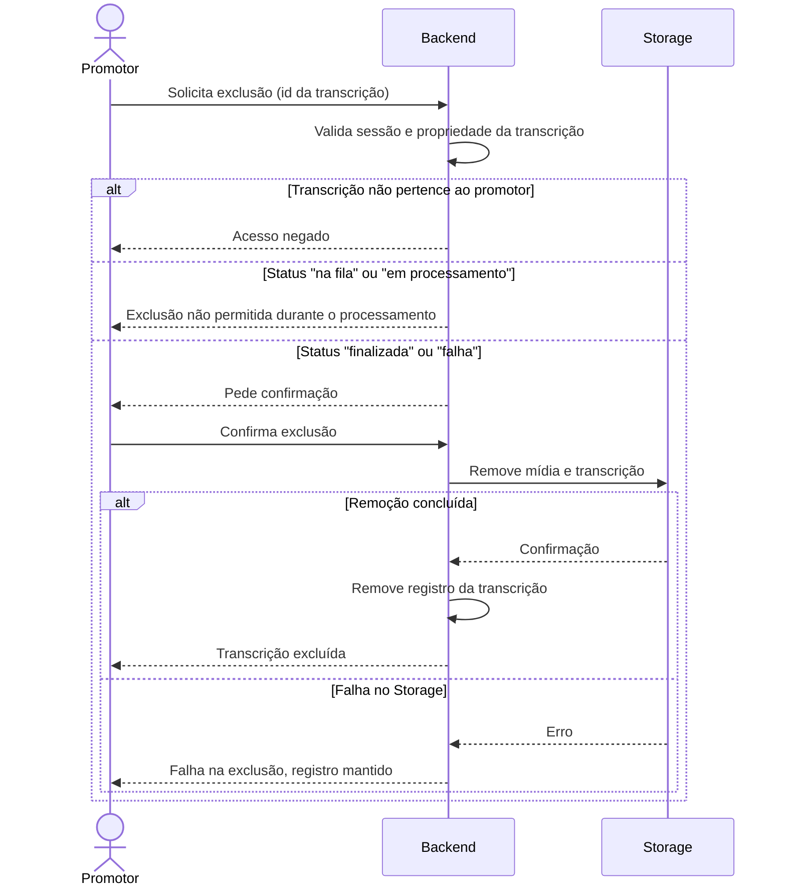

### RQF9: Exclusão de transcrição

Convenções, participantes e premissas estão no [README](README.md) desta pasta.

**Ator:** Promotor.

**Pré-condições:** sessão ativa. Existe uma transcrição do promotor com status `finalizada` ou `falha`.

**Pós-condições:** em caso de sucesso, o Backend removeu a mídia e a transcrição do Storage e apagou o registro. A mídia original permanece no Sistema Processos.

**Tela de referência:** T3b Confirmar exclusão.

Código mermaid

**Notas:** o Backend só remove o registro após a confirmação do Storage, para não deixar arquivos órfãos com dados sensíveis.
